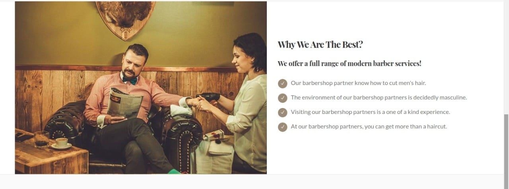

# Barbershop Finder





## Tech Stack

* [**React**](https://reactjs.org/) JavaScript library for building user interfaces
* [**Redux**](https://redux.js.org/)  predictable state container for JavaScript apps
* [**Semantic UI React**](https://react.semantic-ui.com/) React javascript user interface library

## Development

### Installing

Install `yarn` with `npm`

```sh
npm install -g yarn
yarn install
```

Create `.env` file that contains:

```sh
REACT_APP_API_URL=http://localhost:4200
```

### Running

```sh
npm start
```

Also run the [Backend API](https://github.com/barberfinder/barberfinder-backend)

```sh
npm run dev
```